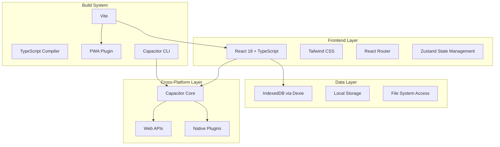
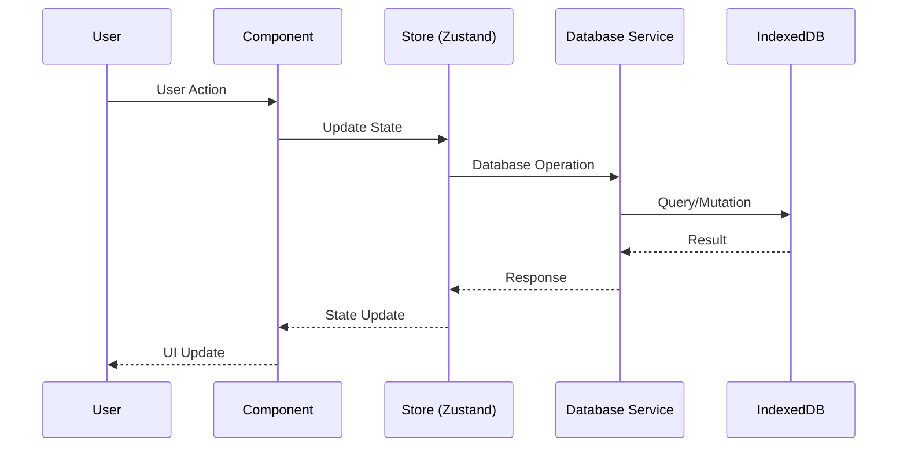
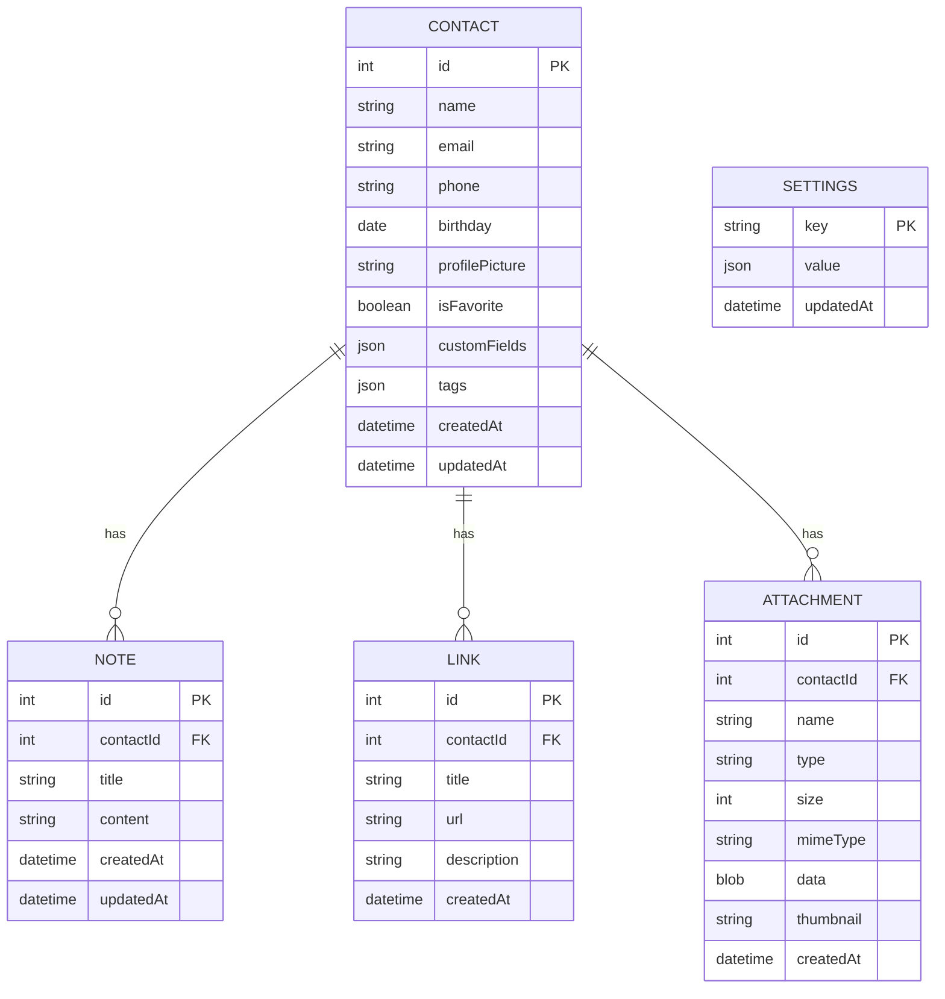

# 📱 Contact Manager

A modern, privacy-focused contact management application built with React, TypeScript, and Capacitor. Designed for organizing and managing personal and professional contacts with ease across all platforms.

<div align="center">


</div>

---

## 🚀 Author

**Rolan** - *Always learning, always building*

- 🔗 **Portfolio**: [rolan-rnr.netlify.app](https://rolan-rnr.netlify.app/)
- 💻 **GitHub**: [@Mrtracker-new](https://github.com/Mrtracker-new)

---

## 📋 Table of Contents

- [Features](#-features)
- [Architecture Overview](#-architecture-overview)
- [Project Structure](#-project-structure)
- [Tech Stack](#-tech-stack)
- [Getting Started](#-getting-started)
- [Platform Support](#-platform-support)
- [Database Design](#-database-design)
- [API Reference](#-api-reference)
- [Deployment](#-deployment)
- [Contributing](#-contributing)
- [License](#-license)

---

## ✨ Features

### 🎯 Core Features
- **Contact Management**: Create, edit, delete, and organize contacts
- **Smart Search**: Fuzzy search with advanced filtering capabilities
- **Profile Pictures**: Upload and manage contact photos with automatic compression
- **Custom Fields**: Add unlimited custom fields for each contact
- **Tags System**: Organize contacts with colorful tags
- **Notes & Links**: Attach notes and external links to contacts
- **File Attachments**: Attach documents, images, and files to contacts

### 🔒 Privacy & Security
- **Offline-First**: All data stored locally using IndexedDB
- **Data Encryption**: Optional AES encryption for backups
- **Privacy-Focused**: No external servers, complete data ownership
- **Secure Backups**: Export encrypted backups with password protection

### 🌐 Cross-Platform Support
- **Web Application**: PWA with offline capabilities
- **Mobile Apps**: Native Android and iOS apps via Capacitor
- **Desktop Ready**: Electron and Tauri compatibility
- **Responsive Design**: Optimized for all screen sizes

### 🎨 User Experience
- **Dark/Light Mode**: System-aware theme switching
- **Modern UI**: Clean, intuitive interface with smooth animations
- **Touch-Friendly**: Optimized for mobile interactions
- **Keyboard Shortcuts**: Efficient navigation for power users

---

## 🏗️ Architecture Overview



### Data Flow Architecture



---

## 📁 Project Structure

```
contact-manager/
├── 📁 src/
│   ├── 📁 components/          # Reusable UI components
│   │   ├── AttachmentSection.tsx
│   │   ├── FloatingActionButton.tsx
│   │   ├── Layout.tsx
│   │   ├── LinkSection.tsx
│   │   ├── MobileNavigation.tsx
│   │   ├── NoteCard.tsx
│   │   ├── NoteSection2.tsx
│   │   ├── ProfilePicture.tsx
│   │   ├── SaveIndicator.tsx
│   │   ├── SearchInput.tsx
│   │   ├── Sidebar.tsx
│   │   └── TopBar.tsx
│   ├── 📁 pages/               # Main application pages
│   │   ├── ContactDetail.tsx   # Contact view/edit page
│   │   ├── ContactList.tsx     # Main contacts listing
│   │   ├── NewContact.tsx      # Contact creation form
│   │   ├── Search.tsx          # Advanced search page
│   │   └── Settings.tsx        # App settings & preferences
│   ├── 📁 db/                  # Database layer
│   │   └── database.ts         # Dexie configuration & operations
│   ├── 📁 store/               # State management
│   │   └── useStore.ts         # Zustand store configuration
│   ├── 📁 services/            # Business logic services
│   │   └── attachments.service.ts
│   ├── 📁 utils/               # Utility functions
│   │   ├── fileOpener.ts       # File handling utilities
│   │   ├── index.ts            # Export/import utilities
│   │   └── mobileFileUtils.ts  # Mobile file operations
│   ├── 📁 types/               # TypeScript type definitions
│   │   ├── index.ts            # Core type definitions
│   │   └── tauri.d.ts          # Tauri-specific types
│   ├── 📁 plugins/             # Capacitor plugins
│   │   └── index.ts            # Plugin registrations
│   ├── App.tsx                 # Main application component
│   ├── main.tsx                # Application entry point
│   └── index.css               # Global styles
├── 📁 android/                 # Android-specific files
├── 📁 dist/                    # Built application files
├── 📁 public/                  # Static assets
├── capacitor.config.ts         # Capacitor configuration
├── package.json                # Project dependencies
├── tailwind.config.js          # Tailwind CSS configuration
├── tsconfig.json               # TypeScript configuration
├── vite.config.ts              # Vite build configuration
└── README.md                   # This file
```

---

## 🛠️ Tech Stack

### Frontend Framework
- **React 18**: Latest React with Concurrent Features
- **TypeScript**: Type-safe development
- **Vite**: Lightning-fast build tool
- **Tailwind CSS**: Utility-first CSS framework

### State Management & Data
- **Zustand**: Lightweight state management
- **Dexie**: IndexedDB wrapper for offline storage
- **React Router**: Client-side routing

### Cross-Platform Development
- **Capacitor**: Native mobile app development
- **PWA**: Progressive Web App capabilities
- **Workbox**: Service worker management

### UI/UX Libraries
- **Lucide React**: Beautiful icons
- **React Hot Toast**: Elegant notifications
- **React Dropzone**: File upload handling
- **Fuse.js**: Fuzzy search functionality

### Development Tools
- **ESLint**: Code linting
- **Prettier**: Code formatting
- **Vitest**: Unit testing framework

---

## 🚀 Getting Started

### Prerequisites

- **Node.js** (v18 or higher)
- **npm** or **yarn**
- **Git**

### Installation

1. **Clone the repository**
   ```bash
   git clone https://github.com/Mrtracker-new/Contact-manager.git
   cd contact-manager
   ```

2. **Install dependencies**
   ```bash
   npm install
   ```

3. **Start development server**
   ```bash
   npm run dev
   ```

4. **Open in browser**
   ```
   http://localhost:5173
   ```

### Build for Production

```bash
# Build web application
npm run build

# Preview production build
npm run preview
```

### Mobile Development

1. **Add mobile platforms**
   ```bash
   # Add Android
   npx cap add android
   
   # Add iOS (macOS only)
   npx cap add ios
   ```

2. **Build and sync**
   ```bash
   npm run build
   npx cap sync
   ```

3. **Open in native IDE**
   ```bash
   # Android Studio
   npx cap open android
   
   # Xcode (macOS only)
   npx cap open ios
   ```

---

## 🌍 Platform Support

| Platform | Status | Features |
|----------|--------|----------|
| **Web Browser** | ✅ Full Support | PWA, Offline, File System API |
| **Android** | ✅ Full Support | Native file access, Share integration |
| **iOS** | ✅ Full Support | Native file access, Share integration |
| **Electron** | 🔄 Compatible | Desktop file operations |
| **Tauri** | 🔄 Compatible | Rust-based desktop app |

### Web Features
- Progressive Web App (PWA)
- Offline functionality
- File System Access API
- Web Share API
- Push notifications (planned)

### Mobile Features
- Native file system access
- Share integration
- Camera access for profile pictures
- Biometric authentication (planned)
- Background sync (planned)

---

## 🗄️ Database Design

### Entity Relationship Diagram



### Database Schema

#### Contacts Table
```typescript
interface Contact {
  id?: number;
  name: string;
  email?: string;
  phone?: string;
  birthday?: Date;
  profilePicture?: string;
  isFavorite: boolean;
  customFields: CustomField[];
  tags: string[];
  createdAt: Date;
  updatedAt: Date;
}
```

#### Notes Table
```typescript
interface Note {
  id?: number;
  contactId: number;
  title: string;
  content: string;
  createdAt: Date;
  updatedAt: Date;
}
```

#### Links Table
```typescript
interface Link {
  id?: number;
  contactId: number;
  title: string;
  url: string;
  description?: string;
  createdAt: Date;
}
```

#### Attachments Table
```typescript
interface Attachment {
  id?: number;
  contactId: number;
  name: string;
  type: 'document' | 'image' | 'video' | 'other';
  size: number;
  mimeType: string;
  data?: Blob | ArrayBuffer | string;
  filePath?: string;
  thumbnail?: string;
  createdAt: Date;
}
```

---

## 🔧 API Reference

### Database Operations

#### Contacts API
```typescript
// Get all contacts
const contacts = await db.contacts.toArray();

// Get contact by ID
const contact = await db.contacts.get(id);

// Create contact
const id = await db.contacts.add(contact);

// Update contact
await db.contacts.update(id, updates);

// Delete contact
await db.contacts.delete(id);

// Search contacts
const results = await db.contacts
  .filter(contact => contact.name.includes(query))
  .toArray();
```

#### Export/Import API
```typescript
// Export data
const data = await dbOperations.exportData();

// Import data
await dbOperations.importData(data);

// Export to Excel
await exportUtils.downloadExcel(data, filename);

// Import from Excel
const data = await exportUtils.readExcelFile(file);
```

### Attachment Service API
```typescript
// Get contact attachments
const attachments = await getContactAttachments(contactId);

// Add attachment
const result = await addAttachment(contactId, files);

// Delete attachment
await deleteAttachment(attachmentId);

// Open file
const result = await openFile(attachment);

// Share file
const result = await shareFile(attachment);
```

---

## 🚀 Deployment

### Web Deployment (Netlify/Vercel)

1. **Build the project**
   ```bash
   npm run build
   ```

2. **Deploy the `dist` folder** to your hosting platform

### Android Deployment

1. **Build the app**
   ```bash
   npm run build
   npx cap sync android
   ```

2. **Generate signed APK**
   ```bash
   cd android
   ./gradlew assembleRelease
   ```

### iOS Deployment

1. **Build the app**
   ```bash
   npm run build
   npx cap sync ios
   ```

2. **Open in Xcode and archive**
   ```bash
   npx cap open ios
   ```

### Docker Deployment

```dockerfile
FROM node:18-alpine

WORKDIR /app
COPY package*.json ./
RUN npm install

COPY . .
RUN npm run build

EXPOSE 5173
CMD ["npm", "run", "preview"]
```

---

## 🤝 Contributing

We welcome contributions! Please see our [Contributing Guide](CONTRIBUTING.md) for details.

### Development Workflow

1. **Fork the repository**
2. **Create a feature branch**
   ```bash
   git checkout -b feature/amazing-feature
   ```
3. **Make your changes**
4. **Add tests if applicable**
5. **Commit your changes**
   ```bash
   git commit -m 'Add amazing feature'
   ```
6. **Push to your fork**
   ```bash
   git push origin feature/amazing-feature
   ```
7. **Open a Pull Request**

### Code Style

- Use **TypeScript** for all new code
- Follow **ESLint** rules
- Use **Prettier** for formatting
- Write **tests** for new features
- Update **documentation** as needed

---

## 📊 Performance Metrics

| Metric | Value |
|--------|-------|
| **Bundle Size** | < 2MB |
| **First Load** | < 3s |
| **Lighthouse Score** | 95+ |
| **Offline Support** | 100% |
| **PWA Score** | Perfect |

---

## 🔒 Security Features

- **Client-side encryption** for sensitive data
- **No external tracking** or analytics
- **Secure file handling** with validation
- **XSS protection** via React
- **Content Security Policy** headers
- **Input sanitization** throughout

---

## 🐛 Known Issues & Limitations

- **Large files**: Attachments > 50MB may cause performance issues
- **iOS Safari**: Some file operations limited by browser restrictions
- **Older browsers**: IE11 not supported, Chrome 90+ recommended

---

## 📈 Roadmap

### Version 1.1 (Q2 2024)
- [ ] Real-time sync across devices
- [ ] Advanced contact grouping
- [ ] Backup scheduling
- [ ] Theme customization

### Version 1.2 (Q3 2024)
- [ ] Contact sharing
- [ ] Team collaboration features
- [ ] Advanced search filters
- [ ] Contact templates

### Version 2.0 (Q4 2024)
- [ ] Calendar integration
- [ ] Task management
- [ ] Email integration
- [ ] API for third-party integrations

---

## 📄 License

This project is licensed under the **MIT License** - see the [LICENSE](LICENSE) file for details.

---

## 🙏 Acknowledgments

- **React Team** for the amazing framework
- **Capacitor Team** for cross-platform capabilities
- **Tailwind CSS** for the utility-first approach
- **Dexie.js** for excellent IndexedDB wrapper
- **Lucide** for beautiful icons

---

## 📞 Support

- 📧 **Email**: [support@contact-manager.com](mailto:support@contact-manager.com)
- 🐛 **Bug Reports**: [GitHub Issues](https://github.com/Mrtracker-new/Contact-manager/issues)
- 💬 **Discussions**: [GitHub Discussions](https://github.com/Mrtracker-new/Contact-manager/discussions)
- 📖 **Documentation**: [Wiki](https://github.com/Mrtracker-new/Contact-manager/wiki)

---

<div align="center">

**Made with ❤️ by [Rolan](https://rolan-rnr.netlify.app/)**

*Always learning, always building*

</div>
