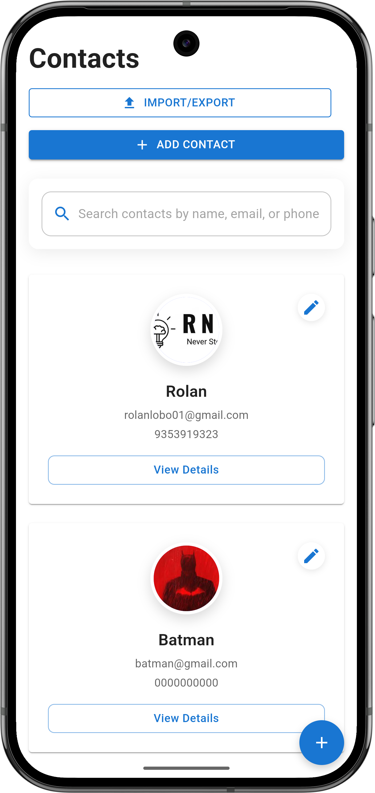
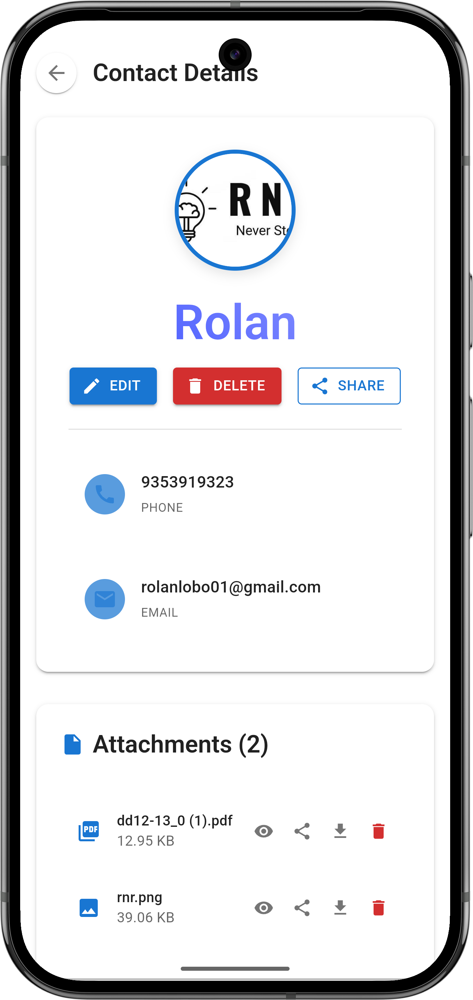
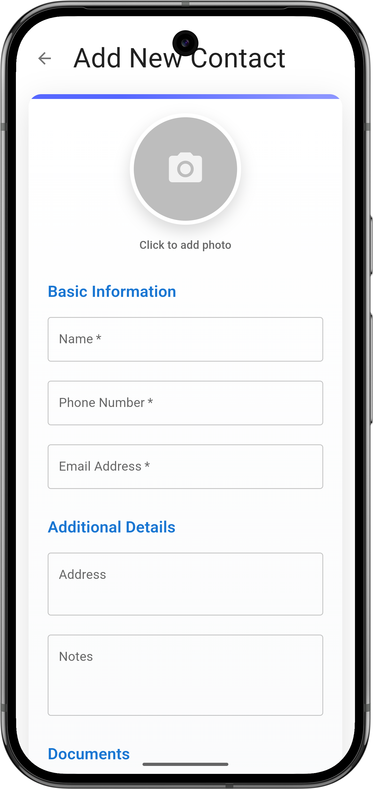
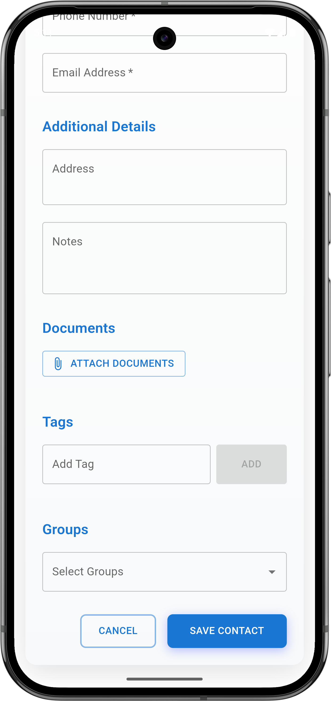

# RNR Contact Manager

  

A modern, cross-platform contact management application built with React and Capacitor, designed to simplify contact organization with rich document attachment capabilities.

## 🌟 Key Features

- **Rich Contact Profiles**: Store comprehensive contact information including photos, addresses, and notes
- **Document Management**: Attach and manage multiple document types (PDF, images, text files, Word docs)
- **Tagging & Categorization**: Organize contacts with custom tags and group assignments
- **Cross-Platform**: Works on web browsers and as a native Android application
- **Offline-First**: Full functionality without requiring constant internet connection
- **Responsive Design**: Optimized for both desktop and mobile experiences
- **Contact Sharing**: Share contacts via QR codes or direct sharing options
- **Import/Export**: Easily import and export contacts in standard formats

## 📱 Screenshots

### Web View

  
  
<em>Home Dashboard - Organize and access all your contacts</em>

  
  
  
<em>Contact Details - View comprehensive contact information</em>

  
  
  
<em>Contact Form - Add and edit contact information with ease</em>

  
  
  
<em>Document Preview - View attached documents directly in the app</em>

  
  
  
<em>Enhanced Document Management - Organize and access documents efficiently</em>

  
  
  
<em>Contact Sharing - Share contacts through multiple channels</em>

  
  
  
<em>Import/Export - Manage contacts in bulk with powerful tools</em>

  
  
  
<em>QR Code Sharing - Generate QR codes for quick contact sharing</em>

### Mobile App View

  
  
<em>Mobile Home - Access your contacts on the go</em>

  
  
  
<em>Mobile Contact Details - Full functionality on mobile devices</em>

  
  
  
<em>Add New Contact - Intuitive mobile form interface</em>

  
  
  
<em>Contact Form Fields - Comprehensive information capture</em>

  
  
  
<em>Additional Fields - Capture all relevant contact details</em>

  
  
  
<em>Mobile Document Preview - View documents on your phone</em>

  
  
  
<em>Mobile Sharing - Share contacts directly from your device</em>

  
  
  
<em>Mobile Import/Export - Manage contacts anywhere</em>

  
  
  
<em>Mobile QR Codes - Generate and scan contact QR codes</em>

## 🚀 Why RNR Contact Manager?

In today's connected world, effective contact management goes beyond storing names and phone numbers. RNR Contact Manager addresses several critical needs:

- **Document Association**: Attach important files directly to contacts (contracts, receipts, ID documents)
- **Organization**: Easily categorize and find contacts using tags and groups
- **Accessibility**: Access your contacts across devices with consistent experience
- **Privacy**: Your data stays on your device with secure local storage
- **Efficiency**: Quickly find and share contact information when you need it most
- **Professionalism**: Present and share contact information in a polished, organized format

## 📋 Perfect For

- **Business Professionals**: Store client information with attached contracts and meeting notes
- **Healthcare Workers**: Maintain patient contact details with relevant medical documents
- **Personal Use**: Organize friends and family contacts with shared photos and important documents
- **Service Providers**: Keep track of customer information with service agreements and receipts
- **Networking Events**: Quickly share your contact information via QR codes
- **Team Collaboration**: Import/export contact lists for team members
- **Remote Workers**: Access important contact information from anywhere
- **Small Businesses**: Maintain a centralized contact database without expensive CRM systems

## 🆕 New Features

### Contact Sharing
Share your contacts easily with others through multiple methods:

- **QR Code Generation**: Generate QR codes for any contact that can be scanned by another device
- **Direct Sharing**: Use your device's native sharing capabilities to send contact information via email, messaging apps, or other platforms
- **Cross-Platform Compatibility**: Shared contacts maintain formatting across different devices and platforms

### Import/Export Functionality
Manage your contacts in bulk with powerful import and export tools:

- **vCard Support**: Import and export contacts in the standard vCard format (.vcf files)
- **Batch Operations**: Process multiple contacts at once for efficient contact management
- **Selective Import**: Choose which contacts to import from a file
- **Export Filtering**: Export specific groups or tagged contacts

### Enhanced Document Management
The document attachment system has been improved with new features:

- **Multiple Document Types**: Support for PDFs, images, text files, and Microsoft Office documents
- **Document Preview**: View attached documents directly within the app
- **Improved Organization**: Sort and categorize documents attached to contacts
- **Quick Access**: Faster access to frequently used documents

### UI/UX Improvements
The user interface has been refined for better usability:

- **Streamlined Navigation**: Improved menu structure for faster access to features
- **Enhanced Mobile Experience**: Optimized layouts for various screen sizes
- **Dark Mode Support**: Comfortable viewing in low-light environments
- **Accessibility Enhancements**: Improved screen reader support and keyboard navigation

## 📱 Installation

### 💻 Web Version

**Clone the repository**
    
    git clone https://github.com/Mrtracker-new/Contact-manager.git

**Install dependencies**

    cd Contact-Manager
    npm install

**Start development server**
   
    npm start

### 📲 Android App

**Build the web app**

    npm run build

**Sync with Capacitor**

    npx cap sync android

**Open in Android Studio**

    npx cap open android

## 💻 Technologies Used

- **Frontend**: React, Material UI
- **Mobile Framework**: Capacitor
- **Storage**: Capacitor Preferences, LocalStorage
- **State Management**: React Context API
- **Navigation**: React Router
- **Document Handling**: Custom document processing utilities
- **Contact Format**: vCard standard implementation

## 🔧 Configuration

The application can be configured through the capacitor.config.json file to adjust permissions and behavior on mobile platforms. Key configurations include:

- Storage permissions
- Camera access for QR code scanning
- File system access for document management
- Sharing capabilities

## 👨‍💻 About the Developer

I'm Roland Lobo, a developer focused on creating practical applications that solve real-world problems. This project combines my passion for React development and creating intuitive user experiences.

- **GitHub**: [Mrtracker-new](https://github.com/Mrtracker-new/)
- **Email**: rolanlobo901@gmail.com

## 📄 License

This project is licensed under the MIT License - see the LICENSE file for details.
